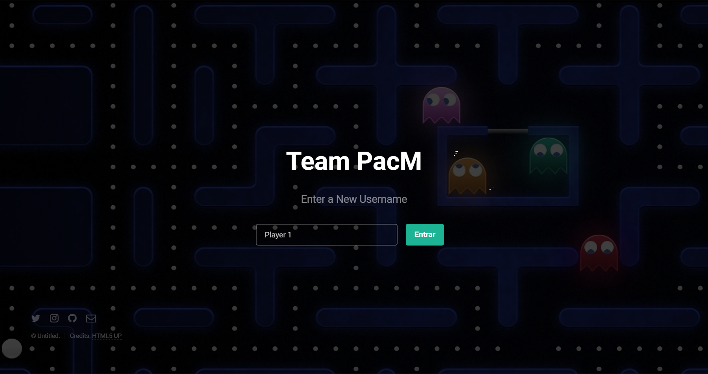
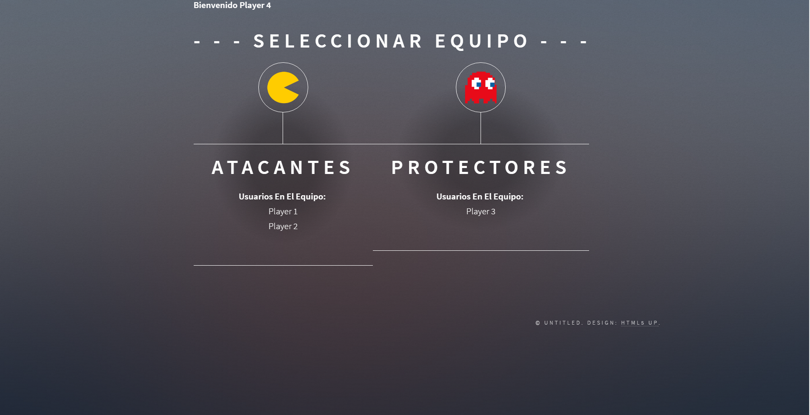
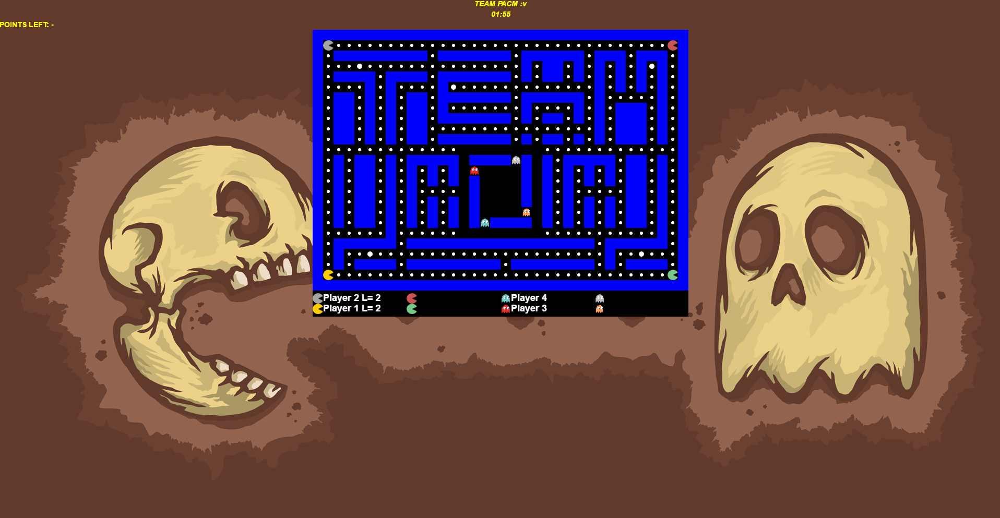

# Team PacM

## college

Escuela Colombiana de Ingeniería Julio Garavito

### Program

Systems Engineering

## Subject

Software Architecture

### Period

2017-1

## Description

Based on Pac-Man, one of the most popular video games in the world, it has been thought to create a game with similar characteristics but with different objectives, highlighting elements of a collaborative system, creating value in the simultaneous participation, and based on the objectives Which have RPG games online. Thus exalting the tools that will be seen in the course.
 
The main idea of ​​the game is based on two teams that share the same board, the teams are divided into teams of "Attackers" (each player has characteristics similar to that of a pac-man), and a team of "Protectors" Each player has characteristics similar to those of a game ghost).
In this case each team has a different objective in the game, in the team of the Attackers its mission is to eat the points of the screen, and the team of the Protectors protect the points of the screen is to prevent the attackers from eating them , All this in a certain time.

## Screenshots

## Link Heroku

http://pacm.herokuapp.com/

